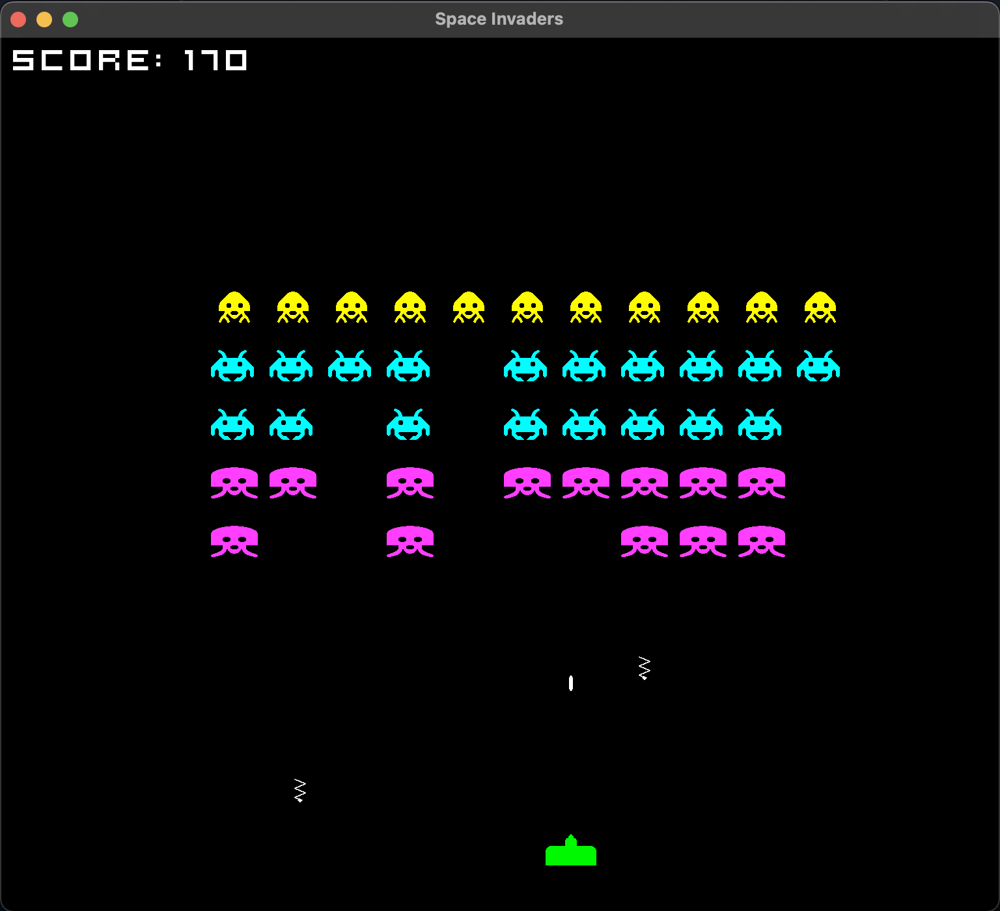
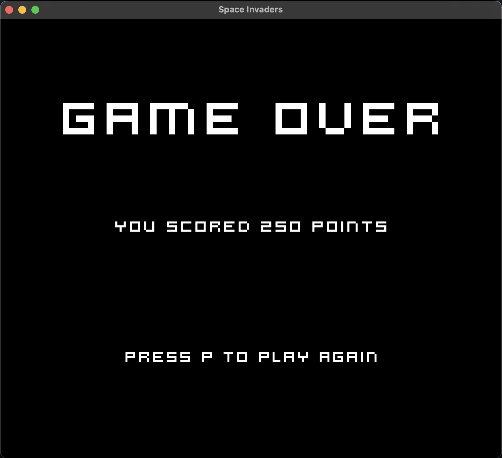

# Metroid Invaders &nbsp;    

This solo project is an imitation of the classic 1978 Taito game, Space Invaders. It has been written in [C++](https://en.wikipedia.org/wiki/C%2B%2B) using the [SFML](https://www.sfml-dev.org/) graphics library.

## Features Pending

- Title screen
- Bunkers protecting the Laser Cannon at the bottom
- **_(Under consideration)_** Submit the player score into a database with their name at game over and display the leaderboard either at game over or on a live website

## Gameplay

The player controls a Laser Cannon at the bottom of the window which can be moved horizontally using the left and right arrow keys. Pressing the spacebar will fire the Laser directly upwards from the Cannon's current position at the time the spacebar is pressed. A 5 x 11 grid of Metroids positioned above gradually moves down. The player must shoot them using the Laser Cannon to score points and move on to the next level before they reach the bottom.

### Rules

- The player begins the game with 3 lives
- The player may only have 1 Laser on the screen at any given time, meaning once the player fires the Laser, they must wait for the Laser to reach the top of the window or collide with a Metroid for them to be able to fire again
- The Metroids move horizontally until they reach the side of the window, at which point they move down a level. Then, they move horizontally back in the other direction before moving down again and continuing this cycle
- Once the player has eliminated all the Metroids, the game moves onto the next level where the Metroids start their movement pattern one vertical level below their starting position of the previous level
- If the Laser Cannon is hit by one of the Metroids' lasers, the player's lives decrease by 1
- The game is over when at least one of the Metroids that are alive reaches the bottom of the window or the player runs out of lives. This position that the bottom of the Metroid needs to reach is 48 pixels above the top of the Laser Cannon

<p align="center">
  
</p>

<p align="center">
  <b>Fig.1 -</b> A screenshot of the game window with the Laser Cannon at the bottom of the board, firing the Laser at the grid of Metroids above while dodging the Metroid lasers. Ridley (sprite yet to be updated) can also be seen hovering above the grid of Invaders. The player's score can be seen in the top left hand corner with the number of lives left in the top right hand corner
</p>

<p align="center">
  
</p>

<p align="center">
  <b>Fig.2 -</b> A screenshot of the game over screen, which will be rendered once the Metroids have reached the bottom of the window or the player has run out of lives
</p>

## How To Use

Start by opening up a terminal and cloning this repository by entering

```
git clone https://github.com/jmcnally17/metroid-invaders.git
```

Then run the game by entering

```
bin/MetroidInvaders
```

into your terminal while in the [main](https://github.com/jmcnally17/metroid-invaders) directory. However, if you would like to have a go at compiling the code yourself, see the instructions below for macOS to get started.

## Getting Started

First, open up a terminal and install Homebrew by running

```
/bin/bash -c "$(curl -fsSL https://raw.githubusercontent.com/Homebrew/install/HEAD/install.sh)"
```

Then, enter `brew install sfml` to install SFML.

This code is compiled using the g++ compile command that comes with the Xcode command line tools, which can be installed by entering

```
xcode-select --install
```

## Compiling

As mentioned earlier, this code has to be compiled into an executable file that your computer can run. This can be done by entering the following command into your terminal while in the [main](https://github.com/jmcnally17/metroid-invaders) directory:

```
g++ -o bin/MetroidInvaders $(find src -name "*.cpp") -I /opt/homebrew/Cellar/sfml/2.5.1_2/include -L /opt/homebrew/Cellar/sfml/2.5.1_2/lib -lsfml-graphics -lsfml-window -lsfml-system -lsfml-audio  -std=c++20
```

As of writing, the current SFML version from Homebrew is 2.5.1. You can check which version you have by using `brew info sfml`. This will also show you the correct path for the `-I` and `-L` options used in the compile command.

Enter `bin/MetroidInvaders` into your terminal and a window should open with the game running.

## Testing

Tests have been written using the [GoogleTest](http://google.github.io/googletest/) framework while adhering to the TDD process. To run the tests, enter

```
bin/tests
```

while in the [main](https://github.com/jmcnally17/metroid-invaders) directory. If you want to compile the tests yourself, you can start by installing GoogleTest with Homebrew by entering

```
brew install googletest
```

Then, using the g++ command mentioned in the previous section, compile the tests with

```
g++ -o bin/tests $(find tests -name "*.cpp") $(find src -name "*.cpp" ! -name "metroidInvaders.cpp")  -I /opt/homebrew/Cellar/googletest/1.13.0/include -I /opt/homebrew/Cellar/sfml/2.5.1_2/include -L /opt/homebrew/Cellar/googletest/1.13.0/lib -lgtest -lgtest_main -lgmock -lgmock_main -pthread -L /opt/homebrew/Cellar/sfml/2.5.1_2/lib -lsfml-graphics -lsfml-window -lsfml-system -lsfml-audio -std=c++20
```

Then the executable file should be in the [bin](https://github.com/jmcnally17/metroid-invaders/tree/main/bin) folder.
